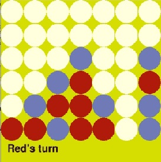

# Connect Four with AI Opponent

Welcome to the Connect Four game with an AI opponent project! This interactive game allows you to play Connect Four against a challenging AI player powered by the Minimax algorithm with alpha-beta pruning. Additionally, this project includes a neural network-based AI opponent for an alternative gameplay experience.

The goal of this project is to showcase the depth of AI capabilities through strategic gameplay powered by advanced algorithms like Minimax with alpha-beta pruning and neural networks.

    

## Overview

This project implements the classic game of Connect Four, where players take turns dropping colored discs into a grid. The objective is to connect four of one's own discs vertically, horizontally, or diagonally before the opponent does.

## Features

- **Graphical User Interface (GUI)**: The game features a user-friendly GUI built using the Pygame library, providing an engaging visual interface for players.
- **Multiple Game Modes**: Play against another human player, challenge the AI opponent, or watch two AI players compete against each other.
- **Minimax Algorithm with Alpha-Beta Pruning**: The AI opponent utilizes the Minimax algorithm with alpha-beta pruning to make strategic decisions and provide a challenging gameplay experience.
- **Scoring System**: The game employs a scoring system to evaluate the potential outcomes of moves, allowing the AI to make intelligent decisions based on the current game state.

## How to Play

1. **Two Player Game**: Play against a friend by taking turns dropping discs into the grid. The first player to connect four discs of their color wins.
2. **Play Against AI**: Challenge the AI opponent, which employs advanced algorithms to make strategic moves and provide a challenging gameplay experience.
3. **Watch AI vs. AI**: Sit back and watch as two AI players compete against each other, showcasing their decision-making abilities and strategic gameplay.

## Implementation Details

- The game logic is implemented in Python, with the GUI powered by the Pygame library.
- The AI opponent's decision-making process is handled by the Minimax algorithm with alpha-beta pruning, allowing it to evaluate potential moves and choose the optimal one.
- The scoring system assesses the potential outcomes of moves based on the current game state, enabling the AI to make intelligent decisions to maximize its chances of winning.

## How to Run

To play the game, simply run the provided Python script. Choose your preferred game mode (two-player, play against AI, or watch AI vs. AI) and enjoy the Connect Four experience!

## Note

- The game provides a visual representation of the AI opponent's moves, allowing players to observe its decision-making process in action.
- Feel free to explore the code and experiment with different settings to customize your gameplay experience.

Enjoy playing Connect Four against the AI opponent and have fun strategizing your way to victory!